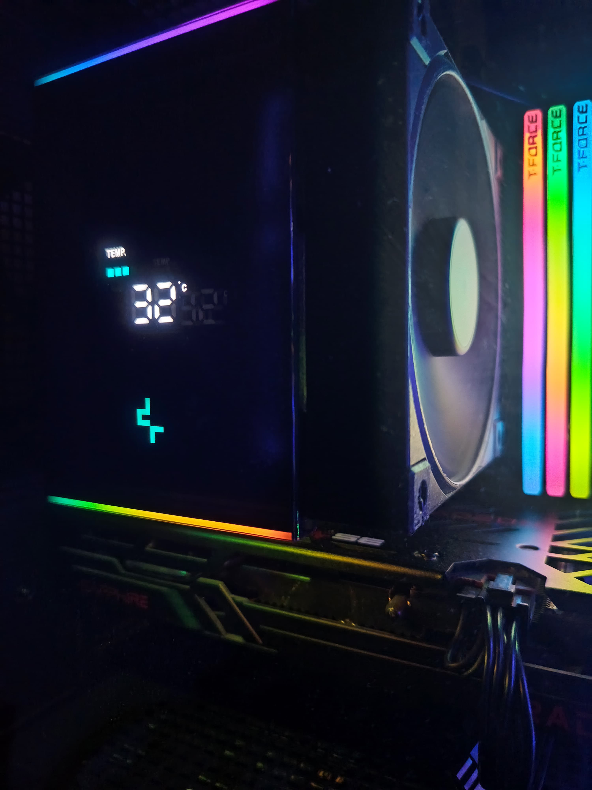

 #  EXKL

Unofficial Linux control software for DeepCool's AK Digital CPU Cooler. Supports AK500 and AK620 devices.


 
### Install

``` bash
git clone https://github.com/z7ealth/exkl.git

./install.sh
```

### Features

- [x] Show CPU temperature C°
- [x] Show CPU temperature F°
- [ ] Show CPU Utilization
- [ ] Systemd service


### Acknowledgements

- raghulkrishna/deepcool-ak620-digital-linux — core inspiration behind the cooler control logic.
