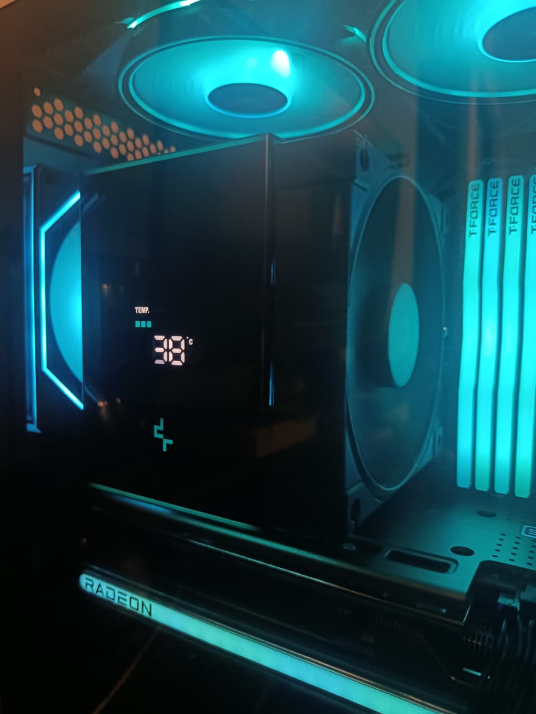
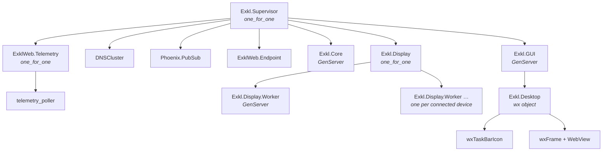
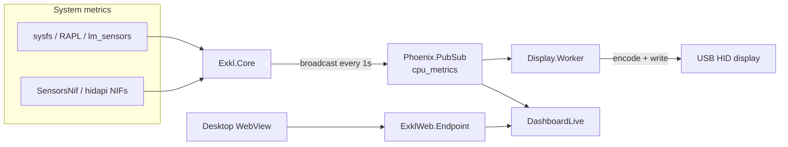

#  EXKL

Unofficial Linux control software for **DeepCool Digital** CPU coolers, case displays, and related HID screens. EXKL drives the device over USB, shows metrics in the tray window, and runs from the system tray.



## Features

- Auto-discover connected DeepCool HID devices (vendor `3633`)
- Live metrics on the cooler display: CPU temperature (°C / °F) and CPU utilization
- Dashboard (embedded tray window) with CPU/GPU temperature, load, frequency, and power
- System tray icon with window, About dialog, and Exit
- User systemd service + XDG autostart fallback + GNOME application launcher
- udev rules for HID access and Intel RAPL CPU power readings

## Dependencies

### Build & runtime (required)

| Component | Purpose |
|-----------|---------|
| Erlang/OTP | BEAM runtime |
| Elixir | Application build |
| GCC, make | Native NIFs (`sensors_nif`, `hid_api_nif`) |
| lm_sensors (`libsensors`) | CPU temperature via `sensors` |
| hidapi (hidraw) | USB HID communication with the cooler |

### Desktop UI (required for tray / About window)

| Component | Purpose |
|-----------|---------|
| wxWidgets (GTK3) | System tray and About dialog |
| WebKitGTK 4.1 | Embedded dashboard window |

### Optional

| Component | Purpose |
|-----------|---------|
| `rocm-smi` / AMDGPU sysfs | AMD GPU metrics |
| Intel RAPL (`/sys/class/powercap`) | CPU power (udev rule installed by `install.sh`) |
| `intel-gpu-tools` (`intel_gpu_top`) | Intel GPU utilization on Xe/i915 when sysfs busy counters are unavailable |
| NVIDIA proprietary driver (`nvidia-smi`) | NVIDIA GPU load, temperature, frequency, and power |

### GPU metrics

| GPU | How EXKL reads metrics |
|-----|------------------------|
| **AMD** | AMDGPU sysfs / lm_sensors |
| **Intel** | i915/xe sysfs hwmon (`temp2_input`, `tile*/gt*/freq0/*`) and optional `intel-gpu-tools` (`intel_gpu_top`) for utilization |
| **NVIDIA** | **`nvidia-smi` (proprietary driver only)** |

**NVIDIA:** the open-source **nouveau** driver does not provide `nvidia-smi`. Install the **proprietary NVIDIA driver** if you want GPU metrics on the dashboard or on dual CPU/GPU displays (e.g. MORPHEUS, CH360/CH560). Without it, NVIDIA GPU load and related metrics are unavailable.

On **hybrid** systems (CPU integrated graphics + discrete NVIDIA GPU), EXKL uses `nvidia-smi` when present so the discrete card is reported instead of the iGPU.

Verify the driver is working:

```bash
nvidia-smi --query-gpu=utilization.gpu,temperature.gpu --format=csv,noheader,nounits
```

If that command fails or is missing, EXKL cannot read NVIDIA GPU metrics.

If the **embedded dashboard window** is blank on NVIDIA systems, see [NVIDIA GPUs (blank WebView)](#nvidia-gpus-blank-webview) under Troubleshooting.

### Install packages by distro

**Arch / Manjaro**

```bash
sudo pacman -S erlang elixir gcc make lm_sensors hidapi wxwidgets-gtk3 webkit2gtk-4.1
```

**Fedora**

```bash
sudo dnf install erlang elixir gcc make lm_sensors-devel hidapi-devel wxGTK3-devel webkit2gtk4.1-devel
```

**Debian / Ubuntu**

```bash
sudo apt install erlang elixir gcc make libsensors-dev libhidapi-dev libwxgtk3.2-dev libwebkit2gtk-4.1-dev
```

Verify native build dependencies:

```bash
make deps-check
```

## Install

```bash
git clone https://github.com/z7ealth/exkl.git
cd exkl
./install.sh
```

The installer will:

1. Check dependencies and compile native NIFs
2. Build a production release
3. Install to `~/.config/exkl`
4. Generate a fresh `SECRET_KEY_BASE` in `~/.config/exkl/env` (used by the systemd service)
5. Create udev rules (`/etc/udev/rules.d/99-exkl.rules`) and add your user to the `exkl` group
6. Enable the user systemd service `exkl.service` (includes `GDK_BACKEND=x11` for Wayland tray support)
7. Install a GNOME/desktop launcher (`~/.local/share/applications/exkl.desktop`) and `bin/launch` to start the service

After install:

- **UI:** open **Show window** from the EXKL system tray icon
- **Launcher:** **EXKL** in the application menu — starts the service if it is not running (no-op while already running)
- **Logs:** `journalctl --user -u exkl.service -f`
- **Status:** `systemctl --user status exkl.service`
- **Observer:** `~/.config/exkl/bin/exkl remote`, then `:observer.start()`

If you were added to the `exkl` group during install, **reboot** before EXKL can access DeepCool HID devices. The service is enabled and starts automatically on login.

### GNOME dock and launcher

On GNOME, the running window is matched to `~/.local/share/applications/exkl.desktop` so the dock shows the **EXKL** name and icon instead of a generic Erlang entry. The wx frame title and tray icon are set in `Exkl.Desktop`.

The desktop launcher runs `~/.config/exkl/bin/launch`, which calls `systemctl --user start exkl.service`. If EXKL is already running, clicking the launcher does nothing — use the tray menu to open the window.

### Wayland vs X11 (system tray)

EXKL uses wxWidgets for the system tray and desktop window.

| Session | Tray behavior |
|---------|----------------|
| **X11** | Works as-is. No extra configuration needed. |
| **Wayland** (tested on **GNOME**) | Set `GDK_BACKEND=x11` so the tray icon appears. Without it, the tray may not show up. |

`./install.sh` already sets `GDK_BACKEND=x11` in the `exkl.service` user unit, so an installed service should work on Wayland after install.

For local development on Wayland, prefix the command:

```bash
GDK_BACKEND=x11 mix phx.server
```

## Troubleshooting

### Blank embedded dashboard (tray **Show window**)

The tray window embeds the dashboard with **WebKitGTK** inside wxWidgets. If the window opens but stays dark or empty while EXKL is otherwise running, check the following.

**1. Confirm the HTTP server is up**

```bash
curl -s -o /dev/null -w "%{http_code}\n" http://127.0.0.1:4500/
```

A `200` response means the dashboard is serving; the problem is the embedded WebView, not EXKL core.

**2. Open the dashboard in a normal browser (workaround)**

While EXKL is running, open:

```text
http://localhost:4500
```

(or `http://127.0.0.1:4500`) in Firefox, Chromium, etc. You get the same live dashboard without the embedded WebView. HID control and the system tray keep working; only the in-app window is bypassed.

**3. GNOME on Wayland**

`install.sh` writes `GDK_BACKEND=x11` into `~/.config/exkl/env` for the user service. If you installed manually or upgraded from an older setup, confirm it is present (see [Wayland vs X11](#wayland-vs-x11-system-tray)), then restart:

```bash
systemctl --user restart exkl.service
```

**4. Missing desktop libraries**

On Arch / Manjaro, install:

```bash
sudo pacman -S wxwidgets-gtk3 webkit2gtk-4.1
```

Verify linkage:

```bash
ldd /usr/lib/erlang/lib/wx-*/priv/wxe_driver.so | grep -E 'not found|webkit|webview'
```

There should be no `not found` lines.

### NVIDIA GPUs (blank WebView)

Systems with an **NVIDIA** GPU and the **proprietary driver** often hit a long-standing **WebKitGTK + NVIDIA** issue: WebKit starts GPU-accelerated compositing, fails to paint (blank window), while the same page loads fine in a normal browser.

This is not specific to EXKL — it affects any app using WebKitGTK on Linux with NVIDIA (see [WebKit bug 180739](https://bugs.webkit.org/show_bug.cgi?id=180739)).

**Fix:** add the following to `~/.config/exkl/env` (one line per variable):

```bash
WEBKIT_DISABLE_COMPOSITING_MODE=1
```

Then restart the service:

```bash
systemctl --user restart exkl.service
```

That disables WebKit’s hardware compositing path and uses software rendering instead. The dashboard may use slightly more CPU, but it should display correctly.

**Lighter options** (try before `WEBKIT_DISABLE_COMPOSITING_MODE` if you prefer):

```bash
WEBKIT_DISABLE_DMABUF_RENDERER=1
```

On Wayland + NVIDIA, this sometimes helps without fully disabling compositing:

```bash
__NV_DISABLE_EXPLICIT_SYNC=1
```

**Example `~/.config/exkl/env` on NVIDIA + GNOME Wayland:**

```bash
PHX_SERVER=true
SECRET_KEY_BASE=...
PORT=4500
GTK_USE_PORTAL=1
GDK_BACKEND=x11
WEBKIT_DISABLE_COMPOSITING_MODE=1
```

The `env` file is read **at service start** (runtime), not at compile time. After any edit, run `systemctl --user restart exkl.service`.

**Quick test without reinstalling** (interactive shell):

```bash
GDK_BACKEND=x11 WEBKIT_DISABLE_COMPOSITING_MODE=1 erl
```

```elixir
:wx.demo()
```

Open the WebView demo tab. If it renders under those variables but not otherwise, add them to `~/.config/exkl/env`.

If the embedded window still fails after env changes, use the [browser fallback](#blank-embedded-dashboard-tray-show-window) at `http://localhost:4500`. GPU metrics on the dashboard still require a working `nvidia-smi` — see [GPU metrics](#gpu-metrics) above.

## Uninstall

```bash
./uninstall.sh
```

Removes the user service, autostart entry, desktop launcher, and `~/.config/exkl`. Optionally removes udev rules and the `exkl` group.

## Architecture

EXKL is an OTP application. The root supervisor starts Phoenix, metrics collection, HID device workers, and the desktop tray UI.

### Supervisor tree


```mermaid
graph TD
  Root["Exkl.Supervisor<br/><i>one_for_one</i>"]

  Root --> Telemetry["ExklWeb.Telemetry<br/><i>one_for_one</i>"]
  Root --> DNS["DNSCluster"]
  Root --> PubSub["Phoenix.PubSub"]
  Root --> Endpoint["ExklWeb.Endpoint"]
  Root --> Core["Exkl.Core<br/><i>GenServer</i>"]
  Root --> Display["Exkl.Display<br/><i>one_for_one</i>"]
  Root --> GUI["Exkl.GUI<br/><i>GenServer</i>"]

  Telemetry --> Poller["telemetry_poller"]

  Display --> Worker1["Exkl.Display.Worker<br/><i>GenServer</i>"]
  Display --> WorkerN["Exkl.Display.Worker …<br/><i>one per connected device</i>"]

  GUI --> Desktop["Exkl.Desktop<br/><i>wx object</i>"]
  Desktop --> Tray["wxTaskBarIcon"]
  Desktop --> Window["wxFrame + WebView"]
```

`Exkl.Display` discovers DeepCool HID devices (vendor `3633`) at startup and starts one `Exkl.Display.Worker` per successfully opened device. `Exkl.GUI` starts `Exkl.Desktop`, which owns the system tray icon and the embedded dashboard window.

### Data flow


```mermaid
flowchart LR
  subgraph sources["System metrics"]
    NIF["SensorsNif / hidapi NIFs"]
    Sysfs["sysfs / RAPL / lm_sensors"]
  end

  Core["Exkl.Core"]
  PubSub["Phoenix.PubSub<br/>cpu_metrics"]
  Workers["Display.Worker"]
  HID["USB HID display"]
  Endpoint["ExklWeb.Endpoint"]
  LV["DashboardLive"]
  WebView["Desktop WebView"]

  Sysfs --> Core
  NIF --> Core
  Core -->|"broadcast every 1s"| PubSub
  PubSub --> Workers
  PubSub --> LV
  Workers -->|"encode + write"| HID
  Endpoint --> LV
  WebView --> Endpoint
```

`Exkl.Core` polls CPU/GPU sensors on a timer and publishes `{:cpu_metrics, %Exkl.AK{}}` on PubSub. HID workers subscribe and push encoded packets to the cooler display; the dashboard subscribes to the same topic via the embedded WebView window.

## Supported devices

USB vendor ID is always **3633** (`0x3633`).

| USB ID | Device | Protocol |
|--------|--------|----------|
| `3633:0003` | AK500 DIGITAL | AK series |
| `3633:0007` | MORPHEUS (case display) | CH series (CPU + GPU) |
| `3633:0029` | AK620 G2 DIGITAL NYX | G2 series |

The same **AK-series** encoder also targets AK400, AK620 (legacy), and AK500S (PIDs `0001`, `0002`, `0004`). Other **G2/NYX** AIOs (AK400/500/700 G2, USB IDs `3633:002a`–`3633:002c`) share the G2 encoder with the AK620 G2 NYX.

Other DeepCool HID products may appear in the tray UI as **Detected** or **Unsupported** until added to the catalog. See the [deepcool-digital-linux device list](https://github.com/Nortank12/deepcool-digital-linux/blob/main/device-list/README.md) for reference PIDs.

## Development

On **Wayland** (e.g. GNOME), use `GDK_BACKEND=x11` so the tray icon shows up. On a native **X11** session you can omit it.

```bash
mix setup          # deps + assets
make all           # build NIFs only
GDK_BACKEND=x11 mix phx.server   # Wayland; optional on X11
```

Open the UI from the system tray (**Show window**). Native NIFs are rebuilt automatically on `mix compile` via `elixir_make` and the project `Makefile`.

### Observer

With EXKL running (installed service or local release), attach a remote shell and start Observer:

```bash
~/.config/exkl/bin/exkl remote
```

```elixir
:observer.start()
```

Use your install path if it is not `~/.config/exkl` (for example `_build/prod/rel/exkl/bin/exkl remote` after `MIX_ENV=prod mix release`).

## Adding a new device

1. **Find the USB IDs**  
   Run `lsusb` and look for `3633:xxxx`, or check the [deepcool-digital-linux device list](https://github.com/Nortank12/deepcool-digital-linux/blob/main/device-list/README.md).

2. **Pick an encoder family** in `lib/exkl/hid_device/catalog.ex`:
   - `:ak_series` — AK400/500/620 legacy air coolers (`lib/exkl/hid_devices/ak_series.ex`)
   - `:ch_series` — dual CPU/GPU case displays (`lib/exkl/hid_devices/ch_series.ex`)
   - `:g2_series` — G2/NYX binary packet format (`lib/exkl/hid_devices/g2_series.ex`)

3. **Add a device struct** under `lib/exkl/hid_devices/` implementing `Exkl.HidDevice.Behaviour`, then delegate to `Exkl.HidDevice.Impl` (see `ak500.ex` or `ak620.ex`).

4. **Register the PID** in `lib/exkl/hid_device/catalog.ex`:

   ```elixir
   99 => {Exkl.HidDevices.MyDevice, :ak_series, "MY DEVICE LABEL"},
   ```

5. **Test** with the device plugged in:

   ```bash
   GDK_BACKEND=x11 mix phx.server   # on Wayland; optional on X11
   ```

   The tray UI **DeepCool devices** panel should list it as Connected. Check logs for HID write errors.

6. **Protocol tweaks** — if the family encoder is wrong, inspect packets in the matching `*_series.ex` module against [deepcool-digital-linux mapping tables](https://github.com/Nortank12/deepcool-digital-linux/tree/main/device-list/tables). Add the device to the **Supported devices** table in this README once it works on hardware.

No changes to `Exkl.Display` are needed; discovery and workers are automatic once the catalog entry exists.

## Acknowledgements

- [Nortank12/deepcool-digital-linux](https://github.com/Nortank12/deepcool-digital-linux) — HID protocol reverse engineering and device PID tables
- [raghulkrishna/deepcool-ak620-digital-linux](https://github.com/raghulkrishna/deepcool-ak620-digital-linux) — early AK620 Linux driver that inspired the original work
- [Algorithm0/deepcool-digital-info](https://github.com/Algorithm0/deepcool-digital-info) — community packet format notes

## License

MIT — see [LICENSE](./LICENSE).
