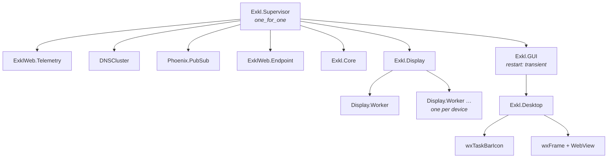
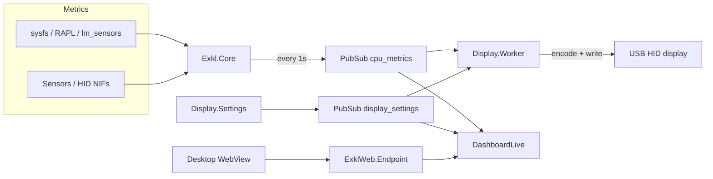

# Architecture

EXKL is an OTP application. The root supervisor starts Phoenix, metrics collection, HID device workers, and the desktop tray UI.

## Supervisor tree

`Exkl.Display` discovers DeepCool HID devices (vendor `3633`) at startup and starts one `Exkl.Display.Worker` per opened device. `Exkl.GUI` starts `Exkl.Desktop` (system tray + embedded dashboard).

`Exkl.GUI` uses `restart: :transient`: the supervisor restarts the GUI after an abnormal exit (for example a wx/WebView crash), but not after tray **Exit** (`{:stop, :normal}` on `Exkl.Desktop`). On intentional Exit, only the wx desktop stops; `Exkl.Core`, `Exkl.Display`, and `ExklWeb.Endpoint` keep running. Restart the user service to bring the tray back after Exit.

## Data flow

`Exkl.Core` polls CPU/GPU sensors and publishes `{:cpu_metrics, %Exkl.AK{}}` on PubSub every second. HID workers encode and write packets when the display screen is on (`Exkl.Display.Settings`). The dashboard subscribes via the WebView (or a browser at `:4500`).

## Desktop UI

| Piece | Role |
|-------|------|
| `Exkl.Desktop` | wx tray menu, frame, WebView → `http://localhost:4500` |
| `ExklWeb.DashboardLive` | LiveView dashboard (metrics, devices, display mode, screen toggle) |
| `ExklWeb.Components.Icon` | Live droplet icon; digits mirror the active metric |
| `ExklWeb.Components.MetricCard` | CPU/GPU cards with gauge, history chart, and stats |

Tray **Show window** opens the WebView; **X** on the frame hides it. **Exit** removes the tray and window only (service keeps running).

## Icons and branding

Icons live under `priv/static/images/icon/` (SVG masters + PNG exports). Paths are resolved at **runtime** via `:code.priv_dir/1` — never as compile-time module attributes (releases install to `~/.config/exkl/`).

| Use | File |
|-----|------|
| System tray | `icon-light.png` (white tile) |
| Window / About dialog | `icon-dark.png` (dark tile) |
| Dashboard favicons | `priv/static/favicon.*`, `site.webmanifest` |
| GNOME launcher | `~/.config/exkl/share/exkl.png` (copied by `install.sh`) |

After icon changes: `MIX_ENV=prod mix release`, re-run `./install.sh`, then `systemctl --user restart exkl.service`.

## Key modules

| Module | Role |
|--------|------|
| `Exkl.Core` | Sensor polling, mode switching, PubSub broadcast |
| `Exkl.Display` | HID discovery and worker supervision |
| `Exkl.Display.Worker` | Per-device encode + USB write; respects screen on/off |
| `Exkl.Display.Settings` | Screen on/off flag (`persistent_term` + PubSub) |
| `Exkl.HidDevice.Catalog` | USB PID → encoder family mapping |
| `Exkl.Desktop` | wx tray icon and WebView window |
| `ExklWeb.Endpoint` | Phoenix HTTP server (port 4500) |

Encoder families: `ak_series`, `ch_series` (dual CPU/GPU), `g2_series` — see `lib/exkl/hid_devices/`.
