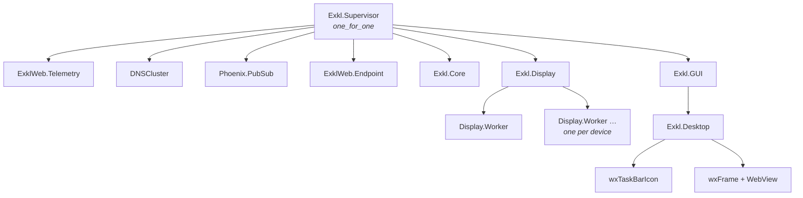
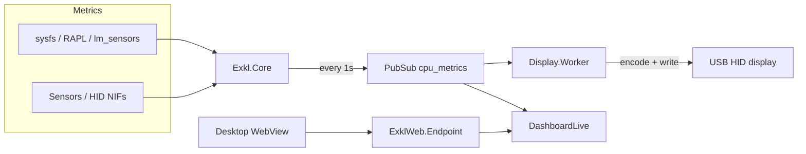

# Architecture

EXKL is an OTP application. The root supervisor starts Phoenix, metrics collection, HID device workers, and the desktop tray UI.

## Supervisor tree

`Exkl.Display` discovers DeepCool HID devices (vendor `3633`) at startup and starts one `Exkl.Display.Worker` per opened device. `Exkl.GUI` starts `Exkl.Desktop` (system tray + embedded dashboard).

## Data flow

`Exkl.Core` polls CPU/GPU sensors and publishes `{:cpu_metrics, %Exkl.AK{}}` on PubSub. HID workers push encoded packets to the cooler display; the dashboard subscribes via the WebView (or browser at `:4500`).

## Key modules

| Module | Role |
|--------|------|
| `Exkl.Core` | Sensor polling, mode switching, PubSub broadcast |
| `Exkl.Display` | HID discovery and worker supervision |
| `Exkl.Display.Worker` | Per-device encode + USB write |
| `Exkl.HidDevice.Catalog` | USB PID → encoder family mapping |
| `Exkl.Desktop` | wx tray icon and WebView window |
| `ExklWeb.Endpoint` | Phoenix HTTP server (port 4500) |

Encoder families: `ak_series`, `ch_series` (dual CPU/GPU), `g2_series` — see `lib/exkl/hid_devices/`.
